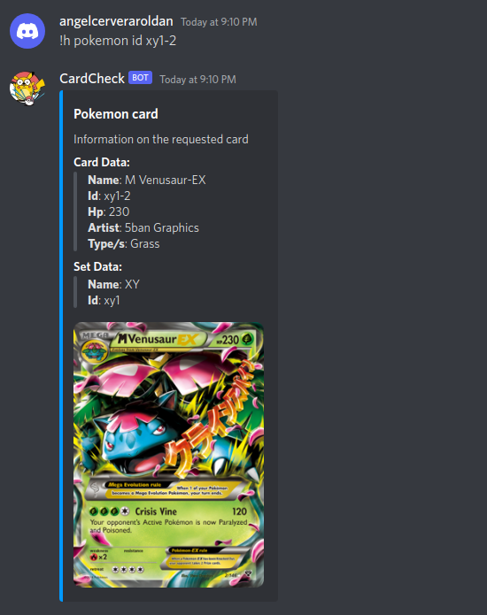
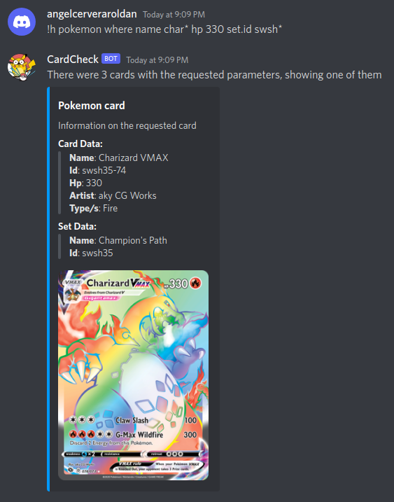

# Cards Bot

## Usage

The bot will listen to all messages in the channels it has access to that start with the bots prefix.

The bots default prefix is `!h`

To run a command, send a message with the following format `<prefix> <command_name> <command_arguments>`

## Commands

### 1. Heartbeat

Command name: `heartbeat`

Command arguments: none

This command is used to check if the bot is working, and reading messages as it should be. If the bot is online and working, it should reply "I'm alive!"


### 2. Find Pokemon card by id

Command name: `pkm` or `pokemon`

Command arguments: `id <id>`

Example:
Response to command `!h pkm id xy1-2`:




### 3. Find Pokemon card/s by parameters

Command name: `pkm` or `pokemon`

Command arguments: `where <params>`

The parameters can be typed in any order

Params:
- name <card name>
- subtypes <**one** of the subtypes you want the card to have>
- hp <hp, to have a hp range, type [x TO y]>
- types <**one** of the types you want the card to have>
- set.name 
- set.id 
- attacks.name <the name of **one** of the attacks you want the card to have>
- artist
- rarity

There is no need to separate parameters in any special way, an example query would be the following:

`name charizard set.id xy-1`

Because order doesn't matter, the query `set.id xy-1 name charizard` would be the same as the previous one

Example:
Response to command `!h pokemon where name char* hp 330 set.id swsh`:
  

  
## Running this bot

To run this bot, run:

1. `docker build --tag docker-bot .` -> Builds binary
2. `docker run --env-file .env docker-bot` -> Executes binary

The env file, should look like:
```
TOKEN=<discord token>
```
