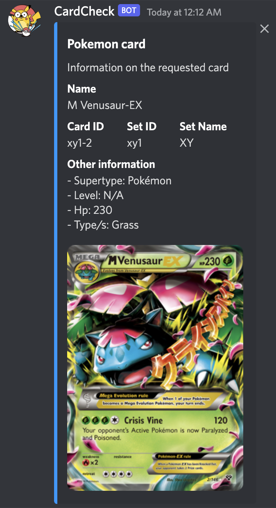

# Card Bot

## Usage

The bot will listen to all messages in the channels it has access to that start with the bots prefix.

The bots default prefix is `!h`

To run a command, send a message with the following format `<prefix> <command_name> <command_arguments>`

## Commands

### 1. Heartbeat

Command name: `heartbeat`

Command arguments: none

This command is used to check if the bot is working, and reading messages as it should be. If the bot is online and working, it should reply "I'm alive!"


### 2. Find Pokemon card by id

Command name: `pkm` or `pokemon`

Command arguments: `id <id>`

Example:
Response to command `!h pkm id xy1-2`:




## Running this bot

To run this bot, run:

1. `docker build --tag docker-bot .` -> Builds binary
2. `docker run --env-file .env docker-bot` -> Executes binary

The env file, should look like:
```
TOKEN=<discord token>
```